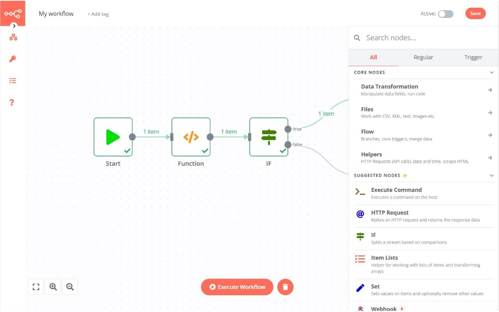

# N8N CI/CD pipeline

Deploy N8N server with CI/CD on Elestio

 
 

# Once deployed ...

You can can open N8N UI here:

    URL: https://[CI_CD_DOMAIN]
    login: root
    password: [SOFTWARE_PASSWORD]

More information about N8N usage can also be found in the documentation.: https://docs.n8n.io/
